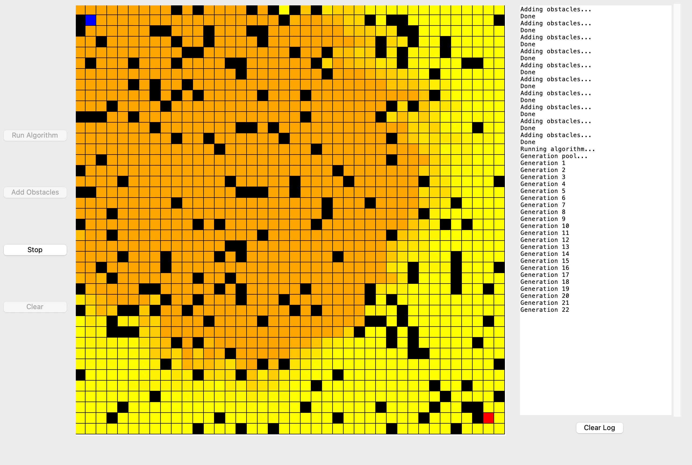

# genetic_algorithm
A genetic algorithm for finding shortest path in graph

-------

### What you need
Python 3

_______
### How you use it

* **Choosing Parameters** 

(Right now in a separate window)  
Choose how many chromosomes you want to add to the pool in the first generation.  
The more chromosomes you add - the more possabilities for a successful one, but a slower run.  
Number of generations will determine how many generations the algorithm will run.  
Stop generations - will determine after how many generations without a change the algorithm will stop.  
Here's an example for a possible run:

* **Adding Obstacles:**   

Starting point in blue, ending point in red  
Obstacles in black

Each click on "Add Obstacles" button will add a few obstacles on the grid

* **Running Algorithm:**  
Hit "Run Algorithm" button.
The paths will start showing on the grid in orange, and will update along the run

You can always stop the run by hitting stop, and later clearing the grid by hitting "Clear"  
Then you'll be able to run the algorithm again and/or add more obstacles.

At the end of a successful run, the grid will show the best path in green:

Feel free to suggest any improvement!